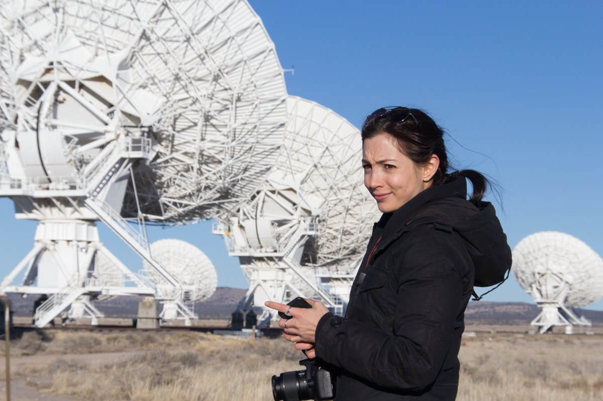

## About

I am a graduate student at the Harvard-Smithsonian Center for Astrophysics where I work with the <a href="https://www.transients.science/">Berger Cosmic Transients Lab</a>. My research focuses on time-domain astronomy, from tidal disruption events to fast radio bursts and superluminous supernovae, with a particular emphasis on the radio properties these events. In the past, I worked as part of the [Long Wavelength Array](http://www.phys.unm.edu/~lwa/index.html) collaboration based out of the University of New Mexico.

Though I'm East coast bound for the time being, I'm a desert dweller at heart, hailing from the enchanted mountains of Northern New Mexico.

## Contact Me

Harvard-Smithsonian Center for Astrophysics  
60 Garden Street, MS-10  
Cambridge, MA 02138  

E-mail: [teftekhari@cfa.harvard.edu](mailto:teftekhari@cfa.harvard.edu)  
Office: P-302

<a href="https://twitter.com/etarraneh" class="twitter-follow-button" data-show-count="false">Follow @etarraneh</a>

